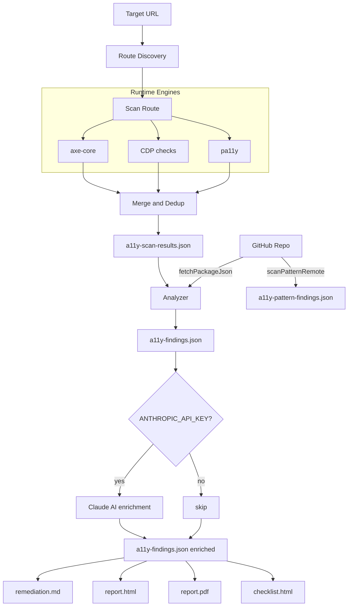
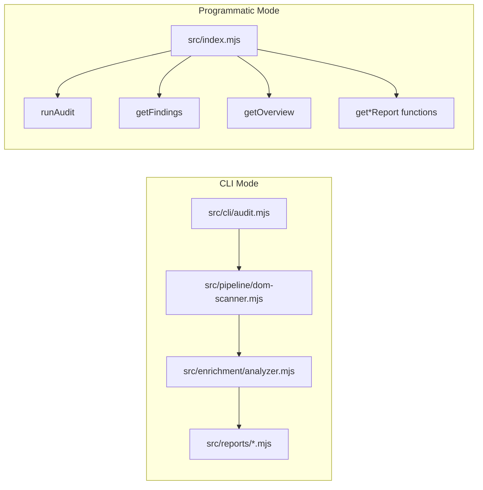

# Engine Architecture

**Navigation**: [Home](../README.md) • [Architecture](architecture.md) • [Intelligence](intelligence.md) • [API Reference](api-reference.md) • [CLI Handbook](cli-handbook.md) • [Output Artifacts](outputs.md) • [Engine Manifest](engine-manifest.md) • [Testing](testing.md)

---

## Table of Contents

- [High-Level Pipeline](#high-level-pipeline)
- [Execution Modes](#execution-modes)
- [Module Responsibilities](#module-responsibilities)
- [Stack Detection Model](#stack-detection-model)
- [Data Contracts](#data-contracts)

The engine is the shared core used by CLI and applications. It runs a multi-engine scan, enriches findings, and produces report-ready outputs.

## High-Level Pipeline



## Execution Modes



- **CLI mode** writes artifacts to `.audit/`.
- **API mode** returns data in memory (objects/strings/buffers).

## Module Responsibilities

| Module | Responsibility |
| :--- | :--- |
| `src/pipeline/dom-scanner.mjs` | Route discovery, engine execution (axe/CDP/pa11y), merge/dedup, progress updates, screenshots |
| `src/enrichment/analyzer.mjs` | Rule enrichment, selector strategy, ownership hints, recommendations, scoring metadata |
| `src/ai/enrich.mjs` | CLI subprocess that runs AI enrichment after the analyzer. Reads `ANTHROPIC_API_KEY` and `AI_SYSTEM_PROMPT` env vars. Non-fatal. |
| `src/ai/claude.mjs` | Anthropic API client. Sends Critical/Serious findings to Claude and parses improved fix suggestions. Supports custom system prompt and repo source file context. |
| `src/core/github-api.mjs` | GitHub API client. Provides `fetchPackageJson`, `fetchRepoFile`, `listRepoFiles`, and `parseRepoUrl`. Used for remote repo scanning and AI source file fetching without cloning. |
| `src/source-patterns/source-scanner.mjs` | Source code pattern scanner. Works against local `--project-dir` or remote `--repo-url` via the GitHub API. |
| `src/reports/*.mjs` | Report builders for markdown/html/pdf/checklist |
| `src/reports/renderers/*.mjs` | Shared rendering and normalization helpers |
| `src/core/asset-loader.mjs` | Centralized access to bundled assets |
| `src/index.mjs` | Public API facade (`runAudit`, `getFindings`, `getOverview`, report APIs, source patterns) |

## Stack Detection Model

Detection combines runtime and source signals:

1. **Runtime signals** from scanned pages:
   - DOM markers, globals, script URLs, and meta tags
2. **Project source signals** when `projectDir` is provided:
   - package dependencies and file structure
3. **Merge strategy**:
   - source-based detection has priority when present
   - runtime detection fills missing fields

Output shape:

```json
{
  "framework": "nextjs",
  "cms": null,
  "uiLibraries": ["radix"]
}
```

## Data Contracts

Core artifacts generated by the pipeline:

- `progress.json`: step status (`page`, `axe`, `cdp`, `pa11y`, `merge`, `intelligence`)
- `a11y-scan-results.json`: merged runtime scan output per route
- `a11y-findings.json`: enriched findings payload used by reports and API consumers

For schemas and field-level details, see [Output Artifacts](outputs.md).
