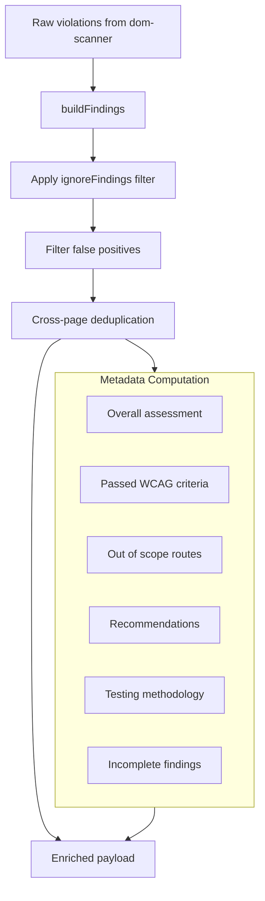

# Intelligence & Enrichment

**Navigation**: [Home](../README.md) • [Architecture](architecture.md) • [Intelligence](intelligence.md) • [API Reference](api-reference.md) • [CLI Handbook](cli-handbook.md) • [Output Artifacts](outputs.md) • [Engine Manifest](engine-manifest.md) • [Testing](testing.md)

---

## Table of Contents

- [Overview](#overview)
- [Enrichment Pipeline](#enrichment-pipeline)
- [Intelligence Database](#intelligence-database)
- [Finding Enrichment](#finding-enrichment)
- [False Positive Filtering](#false-positive-filtering)
- [Cross-Page Deduplication](#cross-page-deduplication)
- [Ownership Classification](#ownership-classification)
- [Persona Mapping](#persona-mapping)
- [Scoring & Compliance](#scoring--compliance)
- [Source Code Patterns](#source-code-patterns)
- [Assets Reference](#assets-reference)

---

## Overview

After the runtime engines (axe-core, CDP, pa11y) produce raw violations, the analyzer transforms them into enriched findings. This is the step that turns a list of rule IDs and selectors into actionable output with fix code, framework guidance, ownership hints, persona impact, and compliance scoring.

The enrichment runs in `src/enrichment/analyzer.mjs` and is invoked by `runAudit` (programmatic) or `audit.mjs` (CLI).

## Enrichment Pipeline

## Intelligence Database

The engine ships a bundled intelligence database at `assets/remediation/intelligence.mjs`. This contains per-rule entries keyed by axe rule ID (e.g. `color-contrast`, `image-alt`) and CDP check IDs (e.g. `cdp-autoplay-media`, `cdp-missing-main-landmark`, `cdp-missing-skip-link`).

Each rule entry can include:

| Field | Purpose |
| :--- | :--- |
| `fix.description` | Plain-language explanation of how to fix |
| `fix.code` | Ready-to-apply code snippet |
| `category` | Grouping label (e.g. "Color & Contrast", "Forms") |
| `related_rules` | Other rule IDs commonly seen together |
| `managed_by_libraries` | UI libraries that handle this rule (e.g. `["radix-ui"]`) |
| `false_positive_risk` | Known false positive patterns for this rule |
| `fix_difficulty_notes` | Edge cases and pitfalls |
| `framework_notes` | Framework-specific fix guidance (keyed by framework ID) |
| `cms_notes` | CMS-specific fix guidance |
| `preferred_relationship_checks` | axe check IDs to prioritize for relationship hints |
| `guardrails` / `guardrails_overrides` | Must/must-not/verify constraints for automated fixes |
| `pm.summary` | One-line business impact for PM audience (e.g. "Buttons without labels block screen reader users from key actions") |
| `pm.impact` | Business/legal/UX consequences for non-technical stakeholders |
| `pm.effort` | Effort classification: `quick-win`, `medium`, or `strategic` |

When a framework is detected (e.g. `nextjs`), only the relevant framework notes are included in the output. React-based frameworks (`nextjs`, `gatsby`) resolve to `react` notes.

## Finding Enrichment

For each raw violation, `buildFindings` produces an enriched finding by:

1. **Selector ranking** — scores all affected selectors by specificity (IDs > data attributes > ARIA > class names), penalizing Tailwind utility classes, and picks the most stable one as `primary_selector`.

2. **WCAG mapping** — maps axe tags to human-readable WCAG labels (e.g. "WCAG 2.1 AA") and resolves the criterion ID (e.g. `1.4.3`) from the WCAG reference database.

3. **Classification** — tags each finding as `A`, `AA`, `AAA`, or `Best Practice` based on its axe tags.

4. **Intelligence lookup** — matches the rule ID against the intelligence database to pull fix description, fix code, category, related rules, guardrails, and difficulty notes.

5. **ARIA role detection** — extracts explicit roles from HTML or infers implicit roles from tag names (e.g. `<nav>` → `navigation`), then links to APG pattern documentation.

6. **Code language detection** — analyzes fix code snippets to determine language (`html`, `jsx`, `css`) for syntax highlighting.

7. **Failure analysis** — extracts the primary failure mode, relationship hints (e.g. "label is not associated with input"), failure check messages, and related DOM context from axe node data.

8. **Component hint** — extracts a semantic component name from the selector (skipping Tailwind utilities) or derives a page hint from the route path.

9. **Impacted users** — looks up which disability groups are affected, first by rule ID, then by axe tag fallback.

10. **File search pattern** — resolves framework-specific glob patterns (from source boundaries) so developers know where to search for the source file.

11. **Stable ID** — generates a deterministic hash (`A11Y-xxxxxx`) from rule ID + URL + selector so findings are stable across scans.

## False Positive Filtering

After enrichment, confirmed false positives are removed. Currently covers:

- `color-contrast` violations where the evidence HTML contains CSS gradients (`linear-gradient`, `radial-gradient`) — axe cannot compute contrast against gradients.
- `color-contrast` violations where the element is hidden (`visibility: hidden`, `display: none`).

The count of removed false positives is stored in `metadata.fpFiltered`.

## Cross-Page Deduplication

When scanning multiple routes, the same component often produces identical violations on every page. The deduplicator groups findings by `rule_id` + normalized `primary_selector` and collapses them into a single representative finding with:

- `pages_affected` — number of pages where this violation appears
- `affected_urls` — list of all affected URLs
- `total_instances` — sum of DOM element instances across all pages

Selectors like `html`, `body`, and `:root` are never grouped (they're too generic).

## Ownership Classification

Each finding is classified by whether the violation lives in the project's editable source or outside it:

| Status | Meaning |
| :--- | :--- |
| `primary` | The finding should be fixed in the project source tree |
| `outside_primary_source` | The element comes from a WordPress plugin, cross-origin iframe, or external embed |
| `unknown` | Source scope could not be determined (no `projectDir` or framework boundaries) |

This drives the `search_strategy` field: `direct_source_patch` for primary findings, `verify_ownership_before_search` for outside/unknown.

## Persona Mapping

The engine maps each finding to disability groups using three layers:

1. **Rule-based** — the WCAG reference database (`assets/reporting/wcag-reference.mjs`) contains a `personaMapping` object that maps persona keys to lists of axe rule IDs. If a finding's `ruleId` matches, it's counted for that persona.

2. **Criterion-based** — if no rule match is found, the engine checks if the finding's WCAG criterion ID is associated with a persona through the rule-to-criterion map.

3. **Keyword fallback** — if neither rule nor criterion matches, the `impactedUsers` text is searched for persona keywords (e.g. "blind", "keyboard", "cognitive").

A single finding can match multiple personas. The persona configuration (`personaConfig`) defines the labels and icons:

| Key | Label |
| :--- | :--- |
| `screenReader` | Screen Readers |
| `keyboard` | Keyboard Only |
| `vision` | Color/Low Vision |
| `cognitive` | Cognitive/Motor |

## Scoring & Compliance

The compliance score is computed from severity totals using weights defined in `assets/reporting/compliance-config.mjs`:

1. **Severity totals** — counts findings by `Critical`, `Serious`, `Moderate`, `Minor` (excluding AAA and Best Practice findings).
2. **Score** — starts at 100, deducts weighted points per finding:
   - Critical: −15 per finding
   - Serious: −5 per finding
   - Moderate: −2 per finding
   - Minor: −0.5 per finding
   - Score is clamped to 0–100 and rounded to nearest integer.
3. **Label** — maps score ranges to grades:

   | Score | Label |
   | :--- | :--- |
   | 90 – 100 | `Excellent` |
   | 75 – 89 | `Good` |
   | 55 – 74 | `Fair` |
   | 35 – 54 | `Poor` |
   | 0 – 34 | `Critical` |

4. **WCAG status** — `Pass` (no findings), `Conditional Pass` (only Moderate/Minor), or `Fail` (any Critical/Serious).

The `overallAssessment` in metadata follows the same logic for the formal compliance verdict.

Additionally, `passedCriteria` lists all WCAG criterion IDs that had explicit axe passes and no active violations — used in reports to show what the site does well.

## Source Code Patterns

The source scanner (`src/source-patterns/source-scanner.mjs`) detects accessibility issues that runtime engines cannot see because they exist only in source code.

### How it works

1. Loads pattern definitions from `assets/remediation/code-patterns.mjs`. Each pattern has:
   - `id` — unique identifier (e.g. `no-aria-hidden-on-focusable`)
   - `regex` — the pattern to search for
   - `globs` — file extensions to scan (e.g. `**/*.tsx`)
   - `title`, `severity`, `wcag`, `wcag_criterion`, `wcag_level`
   - `fix_description` — how to fix matches
   - `requires_manual_verification` — whether context analysis is needed
   - `context_reject_regex` — regex that, if found near the match, means it's not a violation
   - `context_window` — lines of context to check (default 5)

2. Resolves scan directories using framework source boundaries (`assets/remediation/source-boundaries.mjs`). For example, Next.js projects scope to `src/`, `app/`, `pages/`, `components/`.

3. Walks the file tree, skipping `node_modules`, `.git`, `dist`, build outputs, and minified files.

4. For each file matching the pattern's globs, runs the regex line by line. When a match is found:
   - Captures 3 lines of context above and below
   - Runs context validation if `requires_manual_verification` is set — checks if `context_reject_regex` appears nearby. If it does, the finding is marked `potential` instead of `confirmed`.
   - Generates a stable ID (`PAT-xxxxxx`)

5. Output includes a summary with `total`, `confirmed`, and `potential` counts.

### Remote scanning via GitHub API

When `--repo-url` (CLI) or `options.repoUrl` (programmatic API) is provided instead of `--project-dir`, the source scanner uses the GitHub API — no `git clone` required:

1. `listRepoFiles()` fetches the repo file tree using the GitHub Trees API. Falls back to the Contents API for truncated responses (large repos).
2. Files matching each pattern's `globs` are fetched individually via `raw.githubusercontent.com`.
3. The same regex and context rejection logic runs against the fetched content.
4. Results are identical to local scanning.

A GitHub token (`--github-token` or `GH_TOKEN` env var) increases the API rate limit from 60 to 5,000 req/hour and enables private repo access.

### Integration with the audit pipeline

When `runAudit` is called with `projectDir` or `repoUrl` and without `skipPatterns`:

1. The engine fetches `package.json` from the repo (remote) or reads it from disk (local) to detect the framework before the analyzer runs.
2. The analyzer runs with the detected framework context.
3. Source patterns run after enrichment.
4. Pattern findings are attached to the payload as `patternFindings` with their own `generated_at`, `project_dir`, `findings`, and `summary`.
5. The remediation guide (`getRemediationGuide`) renders pattern findings in a dedicated section.

### pa11y ruleId normalization

pa11y reports violations using dotted WCAG criterion codes (e.g. `WCAG2AA.Principle1.Guideline1_4.1_4_3.G18.Fail`). The engine normalizes these in two places:

1. **Equivalence mapping** (`assets/scanning/pa11y-config.mjs`, `equivalenceMap`) — known pa11y codes are mapped to their axe-core equivalent rule ID (e.g. `Principle1.Guideline1_4.1_4_3.G145` → `color-contrast`). These findings are merged and deduplicated with axe findings.

2. **Fallback normalization** (`src/pipeline/dom-scanner.mjs`) — pa11y codes without an axe equivalent are shortened to their last segment (e.g. `WCAG2AAA.Principle1.Guideline1_4.1_4_6.G17` → `pa11y-g17`). This produces a readable rule ID without the full dotted path.

## AI Enrichment

After the analyzer step, the engine optionally runs Claude-powered enrichment on Critical and Serious findings (up to 20 per scan).

### How it works

1. `src/ai/enrich.mjs` reads `a11y-findings.json`, identifies Critical and Serious findings, and sends them to `enrichWithAI()`.
2. `src/ai/claude.mjs` calls the Anthropic API with a system prompt instructing Claude to generate specific, production-quality fix suggestions using the actual violation data (selector, colors, ratio, etc.).
3. When a repo URL is available (`A11Y_REPO_URL` env var), Claude also receives relevant source files fetched via the GitHub API. File selection is scored by how well each file path matches terms extracted from the finding's selector and title.
4. Claude returns a JSON array of improvements. Each improvement contains a `fixDescription` and `fixCode` specific to the finding's context.
5. The engine stores Claude's output in separate fields (`ai_fix_description`, `ai_fix_code`, `ai_fix_code_lang`) — the original engine fixes are preserved unchanged. Improved findings are flagged with `aiEnhanced: true`.

### Activation

AI enrichment runs automatically when `ANTHROPIC_API_KEY` is present in the environment. It is non-fatal — if the API call fails, the pipeline continues with unenriched findings.

### Custom system prompt

The default system prompt instructs Claude to go beyond the generic fix: explain why the issue matters for users, reference the specific selector and violation data, and provide a more complete code example than the engine's default. The prompt can be overridden per-scan via the `AI_SYSTEM_PROMPT` env var or `options.ai.systemPrompt` in the programmatic API.

### PM audience mode

When `ai.audience` is set to `"pm"`, the AI enrichment uses a PM-specific system prompt that generates business-oriented guidance instead of developer-focused fixes. The PM prompt instructs Claude to produce:

- `pmSummary` — one-line business impact in plain language
- `pmImpact` — 2-3 sentences on legal/compliance/UX consequences
- `pmEffort` — `quick-win`, `medium`, or `strategic` with time estimate

These AI-generated PM fields override the static PM fields from the intelligence database for Critical and Serious findings, similar to how `fixDescription` overrides the static fix for dev audience.

## Assets Reference

| Asset | Used by | Purpose |
| :--- | :--- | :--- |
| `remediation/intelligence.mjs` | analyzer | Per-rule fix descriptions, code, guardrails, framework notes. Covers 101 axe-core rules + 3 CDP-specific checks (`cdp-autoplay-media`, `cdp-missing-main-landmark`, `cdp-missing-skip-link`) |
| `remediation/axe-check-maps.mjs` | analyzer | Failure mode and relationship hint mappings from axe check IDs |
| `remediation/guardrails.mjs` | analyzer | Shared guardrail constraints for safe automated fixes |
| `remediation/source-boundaries.mjs` | analyzer, source-scanner | Framework-specific source directory scoping |
| `remediation/code-patterns.mjs` | source-scanner | Regex pattern definitions for source code scanning |
| `reporting/wcag-reference.mjs` | analyzer, reports | WCAG criterion map, persona mapping, impacted users, APG patterns, MDN links |
| `reporting/compliance-config.mjs` | analyzer, reports | Severity weights, score thresholds, impact mapping |
